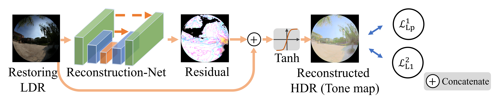

# SingleLM-Net
This repo is an official implementation for Reconstructing fisheye luminance maps with a two-step network from a single low dynamic range image.

## Introduction

Implementing passive daylighting strategies is hindered by glare, and although the high dynamic range (HDR) method aids in real-time glare control, its processing time and complexity are limiting; thus, we propose a two-step network using generative adversarial networks (GANs) and reconstruction-net to transform a single low dynamic range (LDR) image into a comprehensive fisheye luminance map.

Our work achieves the state-of-the-art in restoring luminance maps.

 Quantitative comparison of the luminance map test dataset with current methods, incorporating three metrics: peak signal-to-noise ratio (PSNR) with the standard deviation, R² of daylight glare probability (DGP) and R² of vertical illuminance (E_V). All models are retrained using the luminance map dataset, and the normalization range of data processing is adjusted to ensure that the models effectively function. For all metrics, the higher they are, the better. The bold text indicates the best performance of the metric.
| Method       | PSNR↑          | R² of DGP ↑  | R² of E_V ↑ |
|--------------|----------------|--------------|--------------|
| HDRCNN  | 44.69/4.93     | 0.5987       | 0.5013       |
| Expandnet | 53.52/11.64   | 0.2563       | 0.3585       |
| HDRUNet | 58.72/9.94      | 0.8681       | 0.9112       |
| SingleLDR | 54.82/14.27   | 0.2000       | 0.2724       |
| Ours    | 59.24/11.97    | 0.9054       | 0.9243       |

## Architecture
### LDR-GAN

To restore the absent pixel values resulting from underexposed or overexposed configurations, we introduce the low dynamic range-generative adversarial network (LDR-GAN). The generator architecture of LDR-GAN consists of multilevel scales that are devised to capture distinct features of the input, as informed by Pix2PixHD; the discriminator of LDR-GAN is PatchGAN.

### Reconstruction-Net
The Reconstruction-Net is utilized to generate a high dynamic range (HDR) image, which enables the recovery of a luminance map.

## Luminance map dataset

Our compiled dataset underwent validation through an independent illuminance meter, employing the vertical illuminance (E_V) metric. The E_V values obtained through the HDR method closely align with those acquired from the independent illuminance meter. Stay tuned for the forthcoming link to access the dataset.

## Usage 

This part is coming soon...